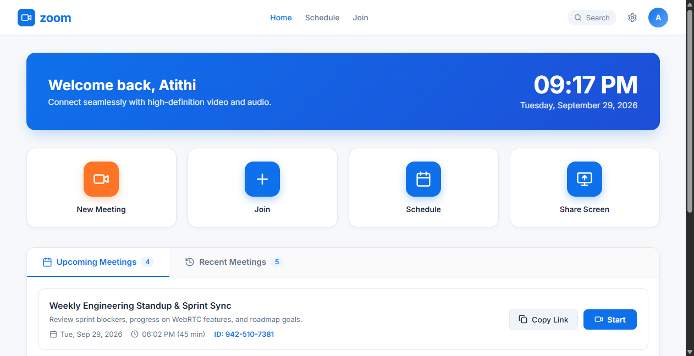
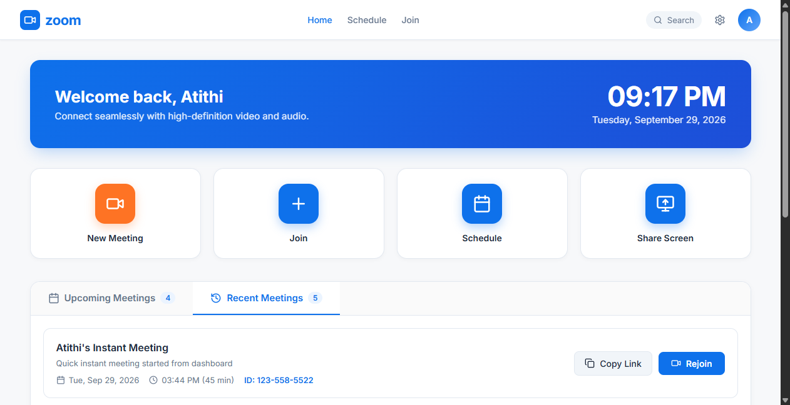
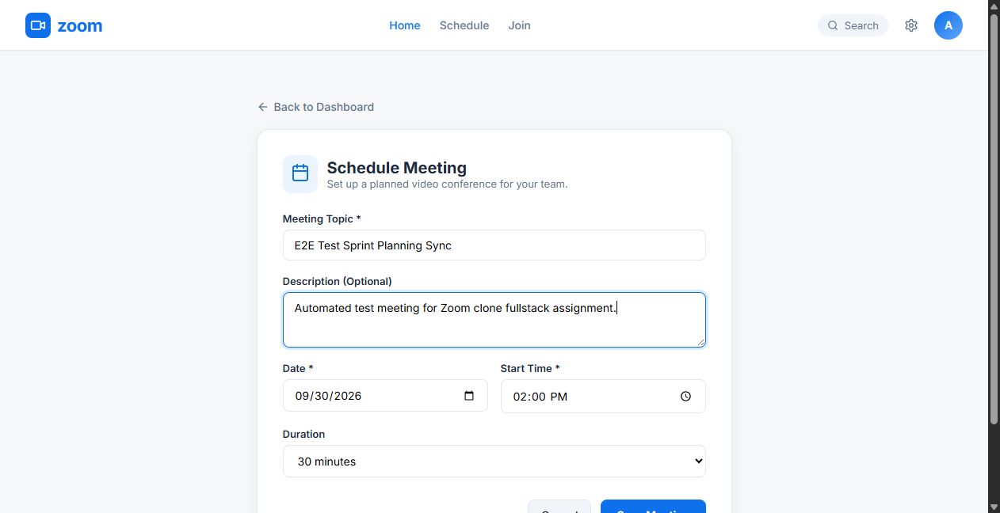
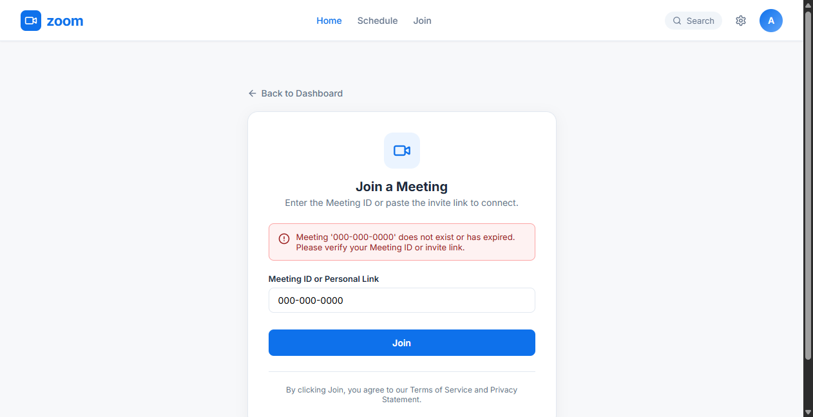
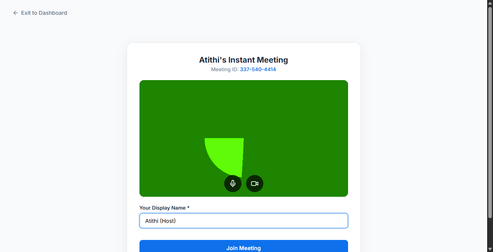

# Zoom Clone - Video Conferencing Web Platform

A full-stack video conferencing web application inspired by Zoom, built with **Next.js (Single Page Application)**, **Python FastAPI**, **SQLite**, and **WebRTC** for real-time peer-to-peer video and audio calling.

---

## 📸 Screenshots & UI Walkthrough

| Landing Dashboard | Upcoming & Recent Meetings |
|:---:|:---:|
|  |  |

| Schedule Meeting | Invalid ID Validation | Pre-Meeting Lobby |
|:---:|:---:|:---:|
|  |  |  |

---

## 🛠️ Technology Stack

- **Frontend**: Next.js 14 (App Router), React 18, TypeScript, Vanilla CSS design system matching modern Zoom.
- **Backend**: Python 3.12, FastAPI, Uvicorn, SQLAlchemy ORM.
- **Database**: SQLite (`zoom_clone.db`) with foreign key enforcement and relational schema.
- **Real-Time Video**: HTML5 `MediaDevices.getUserMedia()` and WebRTC (`RTCPeerConnection` with public STUN servers).
- **Signaling**: FastAPI WebSocket (`/ws/meeting/{meeting_id}`) for lightweight SDP Offer/Answer and ICE candidate exchange.

---

## 🏛️ Project Architecture

```
Zoom_Clone/
├── Backend/
│   ├── app/
│   │   ├── main.py              # FastAPI app, CORS, lifespan table creation & seed
│   │   ├── database.py          # SQLite engine, SessionLocal, PRAGMA foreign_keys
│   │   ├── models.py            # SQLAlchemy models (Meeting, Participant)
│   │   ├── schemas.py           # Pydantic v2 schemas for validation
│   │   └── routes/
│   │       ├── meetings.py      # REST endpoints (CRUD, upcoming, recent, validate)
│   │       └── websocket.py     # WebRTC signaling WebSocket hub
│   ├── seed.py                  # Sample data seeder (3 upcoming & 3 recent meetings)
│   ├── test_api.py              # Automated backend test suite
│   ├── run.py                   # Uvicorn entry point
│   └── requirements.txt
│
├── Frontend/
│   ├── src/
│   │   ├── app/
│   │   │   ├── page.tsx         # Zoom Dashboard (Action tiles, Hero Clock, Meetings tabs)
│   │   │   ├── join/page.tsx    # Join meeting with ID/link validation
│   │   │   ├── schedule/page.tsx# Zoom-style schedule form
│   │   │   ├── meeting/[meetingId]/
│   │   │   │   ├── lobby/page.tsx # Pre-meeting lobby (cam/mic preview, display name)
│   │   │   │   └── page.tsx       # WebRTC dark meeting room & control bar
│   │   │   └── globals.css      # Zoom color palette, cards, and dark room UI
│   │   ├── components/
│   │   │   └── dashboard/       # Navbar, ActionCards, MeetingCard, MeetingList
│   │   ├── lib/
│   │   │   ├── api.ts           # Client API service
│   │   │   └── webrtc.ts        # WebRTC peer connection & signaling helpers
│   │   └── types/               # TypeScript interfaces
│   ├── package.json
│   ├── tsconfig.json
│   └── next.config.js
│
├── screenshots/                 # Captured E2E verification screenshots
└── README.md
```

---

## 🗄️ Database Schema & Relationships

The database is built on SQLite using SQLAlchemy ORM with a clean 1-to-N relationship between `meetings` and `participants`.

```
┌─────────────────────────────────┐           ┌─────────────────────────────────┐
│            meetings             │           │          participants           │
├─────────────────────────────────┤           ├─────────────────────────────────┤
│ id: Integer (PK, autoincrement) │1         N│ id: Integer (PK, autoincrement) │
│ meeting_id: String(32) (UK)     │───────────│ meeting_id: String(32) (FK)     │
│ title: String(255)              │           │ display_name: String(100)       │
│ description: Text               │           │ role: String(32)                │
│ scheduled_at: DateTime          │           │ session_id: String(64)          │
│ duration_minutes: Integer       │           │ joined_at: DateTime             │
│ invite_link: String(512)        │           └─────────────────────────────────┘
│ status: String(32)              │
│ created_at: DateTime            │
└─────────────────────────────────┘
```

### Schema Explanations (For Evaluation):
1. **`meetings` table**:
   - `meeting_id`: Natural Zoom identifier (10 digits formatted as `XXX-XXX-XXXX`, indexed and unique).
   - `status`: String state (`scheduled`, `active`, `completed`).
   - `scheduled_at` & `duration_minutes`: Used by queries to dynamically distinguish **Upcoming Meetings** (`status = 'scheduled'`) from **Recent Meetings** (`status IN ('active', 'completed')`).
   - `cascade="all, delete-orphan"`: Enforces referential integrity so that deleting a meeting automatically cleans up associated participant history.
2. **`participants` table**:
   - Stores session records when any user (host or guest) enters a meeting.
   - `session_id`: Unique client UUID generated when joining from the lobby to distinguish multi-user connections.
   - `role`: `'host'` or `'participant'`.
   - SQLite foreign key enforcement is explicitly activated via `PRAGMA foreign_keys=ON` in `database.py`.

---

## 🚀 Setup & Running Instructions

### Prerequisites
- Python 3.10+
- Node.js 18+ and npm

### 1. Backend Setup (FastAPI)
```bash
cd Backend

# Install dependencies
pip install -r requirements.txt

# Seed sample data into SQLite
python seed.py

# Start the server (runs on http://localhost:8000)
python run.py
```
> The database file `zoom_clone.db` is automatically created and seeded on startup.
> API Documentation is available at `http://localhost:8000/docs`.

### 2. Frontend Setup (Next.js)
```bash
cd Frontend

# Install npm dependencies
npm install

# Start development server (runs on http://localhost:3000)
npm run dev
```

Visit **`http://localhost:3000`** in your browser.

---

## 📡 API Reference

| Method | Endpoint | Description |
|---|---|---|
| `POST` | `/meetings` | Creates an instant meeting (returns unique ID & link) |
| `POST` | `/meetings/schedule` | Schedules a future meeting (Title, Date, Time, Duration) |
| `GET` | `/meetings/upcoming` | Retrieves all upcoming scheduled meetings |
| `GET` | `/meetings/recent` | Retrieves recent meeting history |
| `GET` | `/meetings/{meeting_id}` | Retrieves meeting details |
| `GET` | `/meetings/{meeting_id}/validate` | Validates meeting existence (returns 404 if invalid) |
| `POST` | `/meetings/{meeting_id}/participants` | Registers participant display name & session ID |
| `PATCH`| `/meetings/{meeting_id}/status` | Updates meeting status (`active`, `completed`) |
| `WS`   | `/ws/meeting/{meeting_id}` | WebRTC signaling channel |

---

## 🎥 WebRTC Implementation & How It Works

To keep the implementation simple, reliable, and interview-ready:
1. **Local Media**: `navigator.mediaDevices.getUserMedia({ video: true, audio: true })` captures the user's camera and mic.
2. **STUN Servers**: Uses Google's public STUN servers (`stun:stun.l.google.com:19302`) to resolve public IP addresses for direct peer-to-peer streaming through NAT.
3. **Signaling Flow via FastAPI WebSocket**:
   - **Step 1 (Join)**: Host connects to `/ws/meeting/{id}`. When Guest joins, the server sends `peer-joined` to the Host.
   - **Step 2 (SDP Offer)**: Host creates an `RTCSessionDescriptionInit` offer describing supported video/audio codecs and sends it over WebSocket.
   - **Step 3 (SDP Answer)**: Guest receives the offer, sets it as remote description, generates an answer, and returns it to Host.
   - **Step 4 (ICE Candidates)**: Both peers generate `RTCIceCandidate` packets as network routes are discovered and relay them through the server via `ice-candidate` messages.
   - **Step 5 (Media Streaming)**: Browser directly streams video and audio peer-to-peer.
4. **Camera / Microphone Toggles**: Muting the mic or turning off the camera toggles the track's `.enabled` attribute and updates the UI fallback avatar.

---

## 💡 Key Assumptions

1. **Authentication**: Per assignment instructions ("Assume a default user is logged in"), no login/signup or passwords are required. The dashboard user acts as the host ("Atithi (Host)"), while attendees joining via ID or link provide their display name in the pre-meeting lobby.
2. **Multi-Participant Identity**: Identity is decoupled between the default dashboard host and room participants via unique client session IDs (`sess_...`), allowing two browser windows to test meetings seamlessly.
3. **Database**: SQLite is used for persistent local storage without requiring external database services.
